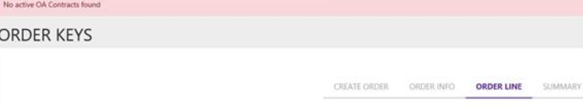

**Title - 5-202382930592_Fail to log in MSC CRM:023809224**

{width="4.506944444444445in"
height="3.508771872265967in"}

**Description**: MSX Login Issue

**Solution**:

1)  Took the call with partner , to check the issue.

2)  Asked to connect with their IT/CIS team to configure IE browser
    settings to login using MSD account.

3)  Also asked to reboot the device .

Resolved.

**Scenario 2:**

**Issue**: User is unbale to login to MSX.

**Description**: After entering the MSX account login id the screen
freezes

{width="4.388888888888889in"
height="4.4348403324584424in"}

{width="2.464583333333333in"
height="2.3125951443569552in"}{width="4.020833333333333in"
height="2.810287620297463in"}

**Solution**:

-   Checked logs and found 'User canceled authentication' error

-   Had a screenshare with the user and checked MDF LDF files, they are
    present.

-   Checked for services, working fine

-   Checked the version of MSC, partner is using old version. Requested
    to install the latest version

-   Partner installed the latest version 2.1.1.2 still the issue is
    persisting.

-   Send to Customer mastering team to check further. Below is the reply
    from them and the issue is resolved

'We are facing some issue in prod AAD, on further investigation we found
that, AAD is throwing some validation exception while partner trying to
configure new business in MSC and hence business configuration is
failing. We have raise an AAD support ticket'

**Route Cause:**

AAD team has added a validation which says while creating AAD
application, we cannot use Microsoft.com domain. They had pushed these
changes on 15^th^ Sep to AAD Production which broke MSC business setup
process.

During MSC business setup process, MSC APIs connects to MDOS Cloud and
registers new AAD application in our custom active directory for the
selected business, since the application registration was failing MSC
users was not able to complete setup. **AAD team had done these changes
without prior any intimation**.

AAD changes and deployment are out of our scope, hence we cannot assure
you that this will not occur in future. Also to prevent this we need
some code changes and we have a huge impact on entire system, especially
on MSC factory floors, hence we cannot directly provide assurance of fix
right away, but on the other note we can say since AAD team has
whitelisted our active directories we are good to go. We need to do
further analysis to come up with the solution to prevent this issue in
future.

**Reference Numbers:** ICM 12339342094, ICM 2329489
